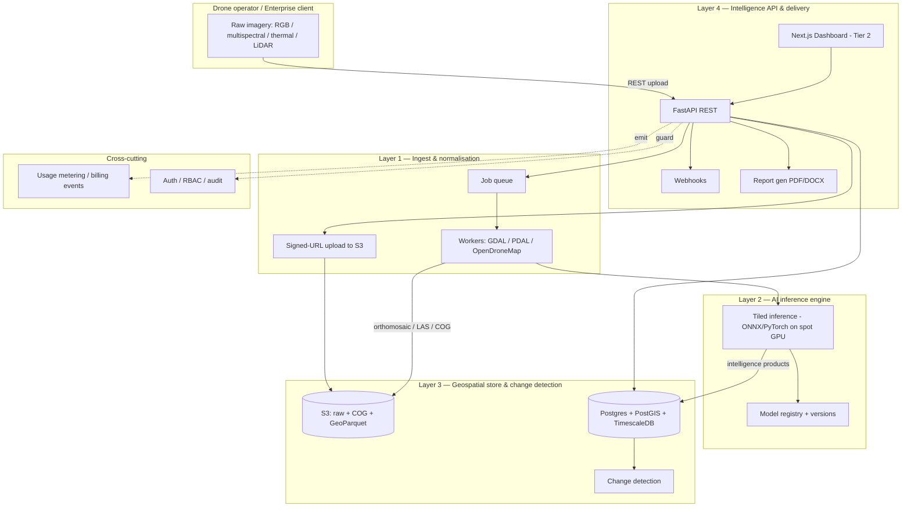

# AeroAtlas — Technical Architecture Plan

**Status:** Draft v1.2 · Plan only (no code yet) · 2026-05-20 · *v1.1: model strategy clarified (fine-tune open models + LLM last-mile). v1.2: proofread pass + added §13 fastest-path-to-POC.*
**Scope:** Engineering architecture, system design, repo structure, tech choices, and a build sequence mapped to the 0–12 month roadmap. Business/GTM is referenced only where it constrains technical decisions.

---

## 0. Guiding principles

These are the non-negotiables that the rest of the plan derives from. If a decision conflicts with one of these, the principle wins.

1. **It's an async, job-oriented system — not a request/response API.** Drone flights are GB-scale files; orthomosaic generation and tiled inference take minutes to hours. The "call an API, get JSON back" UX is real, but it's `submit job → 202 + job_id → webhook/poll`. Design for this from line one.
2. **Model outputs are versioned, immutable facts tied to (flight, AOI, model_version, timestamp).** The defensible asset (Tier 3) is a *consistent* time-series. If you can't reproduce why a 2026 NDVI score differs from a 2027 one, the dataset is worthless to a reinsurer. Versioning is not a "later" feature.
3. **Capture data-usage rights at ingestion.** Tier 3 (data licensing) is only legitimate if every flight carries an explicit record of what AeroAtlas may do with it. Retrofitting consent across millions of flights is impossible. This is a schema decision in Month 0.
4. **Spend nothing you don't have to until volume justifies it.** Pre-seed runway is the constraint. Prefer serverless/spot GPU, managed Postgres, and a single VM over standing infrastructure. The brief's ~$200/mo target is achievable *if* GPU is on-demand.
5. **Prune the stack to what one founder can operate.** The brief lists Kafka, GraphQL, Kubernetes, two databases, six ML architectures. At pre-seed, most of that is a liability. This plan defers ~40% of it (Section 6) and tells you exactly when to re-introduce each piece.
6. **Fine-tune existing open models on proprietary data — don't train from scratch, and don't put a general API model at the core.** The moat is *your Indian dataset + models adapted to it*, not weights built from zero (too slow/costly) and not a general API like Claude (blind to multispectral/LiDAR, breaks per-call economics, replicable by anyone). Much of the "AI" is in fact deterministic geospatial math (NDVI, volumetrics, change detection) that needs no model at all. Claude/LLMs belong in the report/query last-mile (Layer 4) and temporary cold-start triage — never the core perception engine. (See Section 3.)

---

## 1. System architecture (high level)



**The spine in one sentence:** a client uploads a flight to S3 via a signed URL, the API enqueues a processing job, a worker normalises the imagery (GDAL/PDAL/ODM) into internal formats, the inference engine runs the right per-vertical model and writes versioned intelligence products into PostGIS/TimescaleDB, and the client gets a webhook plus a JSON payload — every step emitting a metered usage event.

---

## 2. Layer 1 — Data ingestion & normalisation

**Job:** accept raw imagery from *any* drone and normalise to a small set of internal formats so everything downstream is sensor-agnostic.

### Inputs and the internal canonical formats

| Input sensor | Example hardware | Normalise to |
|---|---|---|
| RGB | DJI Phantom/Mavic | Cloud-Optimised GeoTIFF (COG) orthomosaic |
| Multispectral | Micasense RedEdge, DJI P4M | Per-band COG + radiometrically calibrated reflectance |
| Thermal | FLIR | Calibrated temperature COG |
| LiDAR | Velodyne, Livox | LAS/LAZ point cloud → optional DEM/DSM raster |

**Internal canonical set:** COG (rasters), LAZ (point clouds), GeoParquet (vector/tabular intelligence). Everything downstream reads only these three. New drone = new adapter at the edge, zero changes deeper in.

### Pipeline stages (per flight)

1. **Upload** — client requests a signed S3 URL from the API (idempotency key required; uploads retry). Raw bytes never transit the API process.
2. **Inspect & validate** — read EXIF/sensor metadata, GPS, capture time, CRS hints. Reject early if georeferencing is missing/unrecoverable.
3. **Normalise** — GDAL for raster reprojection + COG conversion; PDAL for point-cloud pipelines; OpenDroneMap (headless `ODM`, not the WebODM UI) for SfM → orthomosaic + DSM.
4. **Radiometric calibration** (multispectral/thermal) — apply reflectance/temperature calibration using panel/metadata. *This is the step people underestimate; raw DN values are not comparable across flights without it.*
5. **Register & emit** — write a `flight` row, persist artifacts to S3, emit a `flight.normalised` event onto the queue for Layer 2.

### Key technical decisions

- **ODM is the long pole.** SfM is CPU/RAM-heavy and slow (tens of minutes to hours for large flights). Run it on dedicated worker instances sized for it, not on the API box. Cache aggressively; make it resumable. Set client SLA expectations honestly — "minutes" is true for inference, not for orthomosaic generation of a large survey.
- **CRS discipline.** Store native CRS, but standardise an internal working CRS per region (Indian UTM zones 42N–47N). Reproject on read for display. Never silently mix CRSs — co-registration for change detection (Layer 3) depends on this being correct.
- **DEFER Kafka.** The brief lists Apache Kafka. At this stage you have *file* ingestion, not high-throughput event streaming. A durable job queue (see §6) does everything you need with a fraction of the ops burden. Re-introduce Kafka only if/when you ingest live drone telemetry streams.

---

## 3. Layer 2 — AI inference engine (your core moat: data + fine-tuned models)

**Job:** turn normalised imagery into structured intelligence with per-vertical models that are **fine-tuned from existing open weights on proprietary Indian data** — never trained from scratch, and never a general API model at the core.

### Model strategy — fine-tune, don't build (and don't outsource the core to a general API)

Three options, one right answer:

- **Train from scratch — no.** Too slow and costly; nobody should do this at pre-seed.
- **Fine-tune existing open models — yes, this is the path.** Download pretrained weights (SegFormer/Swin, or a remote-sensing foundation model such as NASA/IBM's *Prithvi* or *Clay*) and adapt them on proprietary Indian data. This *is* "using existing models" — it just isn't a general chat model — and it is where the moat lives, because a competitor can't reproduce the fine-tuned model without your data.
- **A general API model (e.g. Claude) as the core engine — no.** Wrong for perception: it cannot see multispectral or LiDAR bands, per-tile API cost breaks the ₹3–15/call economics, and anyone can replicate "we forward images to Claude." Reserved for the report/query last-mile (Layer 4) and a *temporary cold-start fallback* — before you have labeled Indian data, a vision-language model can do a rough "is anything anomalous?" first pass to bootstrap while you gather data to fine-tune the real model.

**Much of the "AI" needs no model at all.** NDVI/crop-stress (band arithmetic), LiDAR volumetrics (point-cloud geometry), and change detection (pixel differencing) are deterministic computations in GDAL/PDAL/rasterio — more reliable and effectively free versus any model. Models exist only for the *perception* tasks: segmentation and detection.

### Model portfolio (sequenced, not all at once) — vision models fine-tuned from open weights

| Vertical | Task | Architecture | When |
|---|---|---|---|
| Agri | Crop segmentation / class | SegFormer or Swin-T | Month 0–1 (first model) |
| Agri | Crop-stress *segmentation* (NDVI itself is computed, not modelled) | U-Net | Month 1–3 |
| Agri | Yield / loss probability | Tabular model on top of derived features | Month 3–6 |
| Infra | Defect detection (lines, solar) | YOLOv9 | Month 9–12 (second vertical) |
| Infra/terrain | LiDAR classification / volumetrics | PointNet++ | Month 9–12 |

Your transformer background applies directly: attention-based segmentation (SegFormer/Swin) is SOTA for remote sensing and is the right first bet over older CNN backbones.

### Inference architecture

- **Tiled inference.** Orthomosaics are too large for a single forward pass. Tile (with overlap) → infer per tile → stitch with seam handling → vectorise to GeoParquet (polygons, bounding boxes, per-pixel index rasters as COG).
- **ONNX runtime for serving.** Train in PyTorch/HuggingFace; export to ONNX for inference. Gives you CPU-tolerable latency, portability, and a clean path to edge export later (brief's ONNX goal).
- **GPU strategy — serverless/spot, not dedicated.** Early volume doesn't justify a 24/7 GPU. Use on-demand GPU (Modal / RunPod / Replicate, or AWS spot `g5`) invoked per job. CPU-only ONNX is a viable fallback for the very first demos. This is the single biggest lever on the $200/mo target.
- **Model registry from day one.** Even a minimal one (S3 + a `model_versions` table) — every inference result records the exact `model_version` and parameters that produced it (Principle 2). Graduate to MLflow when you have >1 engineer.

### Fine-tuning pipeline (offline)

- **Always start from open pretrained weights, never random init.** Bootstrap on public Indian datasets (ICAR, Bhuvan) for the first crop model, then fine-tune on pilot-client data as it arrives (Month 1–3 free pilots exist precisely to feed this loop).
- A human-in-the-loop labeling workflow (even a thin internal tool) feeds corrections back. The pilots are a *data acquisition strategy* dressed as free analysis — treat the labeling loop as core infra, not a side script.
- **Reproducibility:** pin datasets, seeds, and configs. A model you can't retrain is a model you can't defend.

---

## 4. Layer 3 — Geospatial data store & change detection

**Job:** store processed intelligence as a queryable, immutable, time-indexed asset — the company's most defensible property.

### Storage tiering

| Data | Store | Why |
|---|---|---|
| Raw + normalised rasters/point clouds | S3 (COG, LAZ) | Cheap, range-readable, infinite scale |
| Vector intelligence (polygons, detections) | PostGIS + GeoParquet on S3 | Queryable now (PostGIS) + analytics-friendly (GeoParquet) |
| Time-series derived indices (NDVI per AOI over time) | TimescaleDB | Purpose-built for time-series rollups |
| Ad-hoc analytics over the lake (Tier 3) | DuckDB over GeoParquet | Zero-infra columnar analytics |

**Run one Postgres, not two systems.** PostGIS *and* TimescaleDB are both Postgres extensions — install both in a single managed instance (RDS or self-hosted) early. Don't operate two databases until scale forces a split. This is a deliberate simplification of the brief.

### Change detection

- **Co-registration is the hard part.** Two flights of the same field weeks apart will not align pixel-perfect. Use GCPs where available; otherwise image-based co-registration before differencing. Misregistration produces fake "change" — this is the #1 source of bad intelligence in this domain.
- Compute deltas as first-class products: crop growth-stage change, structural degradation index, before/after construction volume change. Store each delta tied to the two source flights + model versions.
- The **time-series is the flywheel** (Tier 3). Its integrity depends entirely on Principles 2 & 3 holding. Protect it like production data: immutable writes, versioned, never silently recomputed in place.

---

## 5. Layer 4 — Intelligence API & delivery

**Job:** expose intelligence as a metered API (Tier 1) and a dashboard (Tier 2), with the compliance trappings enterprises require.

### API design

- **REST-first with FastAPI.** Resource model: `Org → Project/Site → Flight → Job → Result`.
- **Async contract:** `POST /flights` → upload → `POST /jobs` returns `202 + job_id`; completion via **webhook** (preferred) or `GET /jobs/{id}`. Document this loudly — it's the integration pattern every client codes against.
- **Idempotency keys** on all mutating calls (large uploads *will* be retried).
- **Versioned from v1** (`/v1/...`). You will change payload shapes; clients embedding this in claims workflows cannot tolerate silent breaks.
- **DEFER GraphQL (Strawberry).** It's in the brief, but a metered REST API is simpler to bill, cache, and rate-limit, and it's what enterprise integration teams expect. Add GraphQL only if a Tier-2 dashboard or a specific client genuinely needs flexible nested queries.

### Delivery surfaces

- **Dashboard (Tier 2):** Next.js + Mapbox GL JS + deck.gl for raster/vector overlays and change-over-time views. It is a *client of the same API* — no privileged backdoor. This is the Month 9–12 wedge for non-engineering clients.
- **Reports:** server-side PDF/DOCX generation for compliance buyers (NHAI, PGCIL). Template-driven and reproducible from the underlying versioned results; an **LLM (Claude) writes the narrative prose around the numbers** — the figures come from the deterministic pipeline, the model only phrases them, so it can never invent data.
- **Natural-language query (Tier 2):** an **LLM (Claude)** translates plain-English questions ("which sites degraded >20% since last quarter?") into queries over PostGIS/TimescaleDB — the self-serve hook for non-technical dashboard users.
- **Tile serving:** put a tile server (TiTiler) in front of COGs so the map renders large rasters via range requests instead of shipping whole files.

---

## 6. Tech-stack decisions — keep / defer / swap

Opinionated triage of the brief's stack for the pre-seed → seed window. "Defer" means *re-introduce at the noted trigger*, not "never."

| Component | Verdict | Rationale / trigger |
|---|---|---|
| GDAL, PDAL, OpenDroneMap | **Keep** | Non-negotiable core of Layer 1 |
| S3-compatible storage | **Keep** | Foundation of the data lake |
| Apache Kafka | **Defer** | Use a job queue; revisit when ingesting live telemetry streams |
| PyTorch / HuggingFace / ONNX | **Keep** | ONNX is what makes CPU/edge inference viable |
| SegFormer/Swin (agri) | **Keep (first)** | Fine-tune from open weights; start here; matches your transformer background |
| Geospatial foundation model (Prithvi / Clay) | **Evaluate (first)** | Open, pretrained on earth-observation data; strong fine-tuning base for multispectral |
| YOLOv9 / PointNet++ | **Defer to M9–12** | Second vertical (infra/LiDAR), not MVP |
| PostGIS + TimescaleDB | **Keep, co-locate** | One Postgres with both extensions, not two systems |
| GeoParquet + DuckDB | **Keep (light)** | Analytics layer; matures into the Tier-3 surface |
| FastAPI + Celery | **Keep** | Core API + async jobs |
| Celery broker | **Decision** | Redis (simplest) or SQS (managed, durable) — pick one in week 1 |
| GraphQL / Strawberry | **Defer** | REST-first; add on concrete client demand |
| Next.js / Mapbox / deck.gl | **Defer to M9–12** | Dashboard is Tier 2, post-pre-seed |
| Kubernetes | **Defer** | ECS/Fargate or single VM + docker-compose until team > 3 and load demands it |
| GPU (dedicated) | **Defer** | Serverless/spot GPU per job until volume justifies standing GPU |
| Claude / LLM API | **Add (delivery layer only)** | Report narrative, NL query, cold-start triage — never the core perception engine |

---

## 7. Cross-cutting concerns

### Multi-tenancy
- **Shared DB + Postgres Row-Level Security (RLS), `org_id` on every row.** Simplest model that gives real isolation at this scale. Avoid DB-per-tenant (ops nightmare for a solo founder).
- Tier 3 needs cross-tenant aggregation — but only over data whose `usage_rights` permit it (see below). Build the aggregation as a separate read path over GeoParquet/DuckDB, never by loosening tenant isolation on the live store.

### Metering & billing (Tier 1 is metered — this is revenue infrastructure)
- Emit a structured **usage event** for every billable action (API call, hectares processed, job completion). Append-only event log → periodic aggregation into invoiceable counters.
- Bill on a unit that scales with *their* drone volume (per-call and/or per-hectare). Get this instrumented in Month 0 even before you charge — you can't price what you didn't measure.

### Data rights & consent (Principle 3)
- Every `flight` carries an explicit `usage_rights` record: may AeroAtlas use it for model training? for aggregated Tier-3 licensing? Captured at ingestion, enforced everywhere downstream.
- This is the legal backbone of the entire Tier-3 thesis. It is a Month-0 schema decision, not a legal-review-later item.

### Security & compliance (DGCA-aligned)
- **Data residency:** AWS Mumbai (`ap-south-1`). Drone geospatial data has localisation sensitivity; default to in-country.
- RBAC, audit logs (who accessed which intelligence product when), encryption at rest + in transit, signed URLs with short TTLs.
- No-fly-zone / sensitive-site awareness as a metadata flag on AOIs.

---

## 8. Proposed repository structure (monorepo)

A Python monorepo is right for a 1→3 person team: one CI, atomic cross-cutting refactors, shared schemas. (No code is written yet — this is the target layout.)

```
aeroatlas/
  apps/
    api/              # FastAPI service (Tier 1 API + Tier 2 backend)
    worker/           # Async workers (ingest, ODM, inference orchestration)
    web/              # Next.js dashboard (Tier 2)        [M9–12]
  packages/
    ingest/           # L1: format adapters, GDAL/PDAL/ODM orchestration, calibration
    geo/              # L3: PostGIS/raster helpers, COG, change detection, co-registration
    inference/        # L2: tiled inference, ONNX runtime, stitching, vectorisation
    schemas/          # Shared Pydantic models / API contracts (single source of truth)
    billing/          # Usage events, metering, aggregation
    rights/           # Data-usage rights model + enforcement
    common/           # Config, logging, auth, db, RLS helpers
  ml/
    training/         # Fine-tuning pipelines, experiment configs (pinned, reproducible)
    registry/         # Model registry glue (S3 + model_versions table; MLflow later)
    datasets/         # Dataset prep (ICAR/Bhuvan bootstrap + pilot data)
  infra/
    terraform/        # IaC from day one
    docker/           # Dockerfiles, compose for local dev
  docs/
    ARCHITECTURE_PLAN.md   # this file
    api/              # OpenAPI spec, integration guide
  tests/
```

Frontend (`apps/web`) can split into its own repo later if the team specialises; start co-located.

---

## 9. Infrastructure & deployment

**Phase 1 (Month 0–6) — minimal, ~$200/mo target**
- 1 small EC2/Fargate for API + 1 worker box sized for ODM; scale workers to zero between jobs.
- 1 managed Postgres (PostGIS + TimescaleDB), smallest viable instance.
- S3 buckets (raw / processed / artifacts), lifecycle rules to cheap storage tiers.
- Redis (or SQS) as the Celery broker.
- **GPU on-demand only** (serverless/spot), invoked per inference job.
- Terraform for all of it; Docker images; deploy via a simple CI pipeline.

**Phase 2 (Month 9–12) — scale**
- Autoscaling worker pool; separate GPU worker pool on spot.
- Read replica / partitioning if the time-series store grows hot.
- Tile server (TiTiler) for the dashboard.
- Observability: structured logs, metrics, job-level tracing, cost dashboards (GPU spend is the variable to watch).

**Defer until forced:** Kubernetes, multi-region, Kafka, a separate analytics warehouse.

---

## 10. Build sequence (mapped to the 0–12 month roadmap)

| Window | Business milestone | Technical deliverables | Architecture decisions to lock |
|---|---|---|---|
| **M0–1** Foundation | Ingest MVP + first model | DJI RGB+multispectral ingest → ODM orthomosaic → SegFormer crop segmentation → async REST endpoint → S3 + PostGIS. Deploy minimal on AWS Mumbai. | Storage layout; canonical formats (COG/LAZ/GeoParquet); job queue (Redis vs SQS); tenant model (RLS); **usage-event schema**; **data-rights schema**; CRS strategy; model-version tracking |
| **M1–3** Validation | 2 free pilots, fine-tune on Kharif data | Multispectral calibration; NDVI (computed) + U-Net crop-stress segmentation; labeling loop; model registry + versioning; change-detection v0 | Reproducible training; co-registration approach; rights capture enforced in pipeline |
| **M3–6** First revenue | 1 paid pilot (insurer/EPC) | RBAC + audit; webhooks; **metering → billing export**; PDF/DOCX reports; monitoring + SLAs; idempotent uploads | API v1 contract freeze; SLA definitions; pricing unit (call vs hectare) |
| **M6–9** Pre-seed | Raise with 1 anchor client | Hardening, cost optimisation, demo polish; (optional) GraphQL only if a client needs it | What scales vs. what gets rebuilt post-raise |
| **M9–12** Scale | +2–3 engineers, 2nd vertical, dashboard | Infra vertical (YOLOv9 defects, PointNet++ LiDAR); Next.js dashboard (Tier 2); self-serve onboarding; DuckDB/GeoParquet analytics layer (Tier-3 foundation) | When to split services; MLflow; autoscaling GPU pool; Tier-3 aggregation read path |

---

## 11. Key technical risks & mitigations

| Risk | Impact | Mitigation |
|---|---|---|
| ODM orthomosaic time/cost | Breaks the "minutes" UX; blows compute budget | Right-size + scale-to-zero ODM workers; resumable jobs; honest SLAs; cache |
| GPU cost vs. latency | Kills the $200/mo target or the UX | Serverless/spot GPU; ONNX CPU fallback for demos; batch where possible |
| Change-detection co-registration | Fake "change" → wrong intelligence → lost client trust | GCP-based + image-based co-registration before differencing; QA gate |
| Model drift breaking time-series | Tier-3 dataset loses integrity → core thesis fails | Version every output (Principle 2); never recompute in place; track model lineage |
| Multispectral/thermal calibration | Indices not comparable across flights | Calibration is a mandatory pipeline stage, not optional |
| Data-rights gaps | Tier-3 licensing legally unsound | Rights captured at ingestion + enforced downstream (Principle 3) |
| Heterogeneous sensors | Ingest complexity explodes | Adapter-at-the-edge pattern; everything internal speaks COG/LAZ/GeoParquet |
| Over-building the stack | Burns runway, slows iteration | The defer list (§6); single Postgres; no K8s/Kafka early |

---

## 12. Decisions to make in week 1

These are blocking and cheap to decide now, expensive to change later:

1. **Job queue broker:** Redis (simplest) vs SQS (managed, durable). → recommend SQS if you want zero ops, Redis if you want local-dev parity.
2. **Serverless GPU provider:** Modal / RunPod / Replicate / AWS spot. → pick one, wrap behind an `inference` interface so it's swappable.
3. **Billing unit:** per-call, per-hectare, or hybrid. → instrument both metrics even if you bill on one.
4. **Internal working CRS policy** for Indian regions (UTM zone handling).
5. **`usage_rights` and `usage_event` schemas** — draft them before the first `flight` row is ever written.
6. **Cloud region:** confirm `ap-south-1` (Mumbai) for residency.

---

## 13. Fastest path to a POC (build this first)

**Goal:** prove the one-line thesis — *raw drone imagery in → refined intelligence out, via an API* — in days, not weeks, with something demoable to a pilot client or investor. This is deliberately leaner than the Month 0–1 MVP.

**The demo, in one sentence:** upload a multispectral GeoTIFF, get back a crop-stress JSON payload (mean NDVI, % stressed area, stress-zone polygons) plus a colour-coded overlay image — in seconds.

**Why this slice:** NDVI is deterministic band math (Principle 6) — *no model, no training data, no GPU, no labels*. It is the fastest possible path to a credible "intelligence" output, and it is exactly the crop-stress signal an agri-insurer recognises.

### Ruthless scope cuts (add these back later)
| Cut for POC | Why it's safe to cut now | Add back at |
|---|---|---|
| OpenDroneMap / SfM | The slow, fragile long pole; accept a *pre-orthorectified* GeoTIFF instead | M0–1 MVP |
| Fine-tuned models / GPU | NDVI needs none; proves value without them | M0–1 (SegFormer) |
| Async jobs / webhooks | NDVI on one ortho is fast → a synchronous response is fine | M0–1 |
| S3 / multi-tenancy / auth | Local disk + a single hardcoded API key | M0–1 / M3–6 |
| Billing, RBAC, audit | Not needed to prove the thesis | M3–6 |

### Minimal stack
- **FastAPI** — one endpoint: `POST /v1/analyze` (multipart GeoTIFF in → intelligence JSON out).
- **rasterio + numpy** — read bands, compute `NDVI = (NIR − Red) / (NIR + Red)`, threshold to a stress mask.
- **rasterio.features / shapely** — polygonise stress zones into GeoJSON.
- **GDAL** — render a colour-mapped overlay (PNG or COG).
- Runs locally or in one Docker container. No GPU, no cloud required for the demo.

### Output shape (the contract clients integrate against)
```json
{
  "flight_id": "poc-001",
  "metrics": { "ndvi_mean": 0.42, "stressed_area_pct": 18.3 },
  "stress_zones": [ { "geometry": "<GeoJSON polygon>", "severity": "high" } ],
  "overlay_url": "/results/poc-001/ndvi_overlay.png",
  "model_version": "ndvi-deterministic-v0"
}
```
The `model_version` field exists from day zero (Principle 2) even though v0 is pure math — so the contract never has to break when real models arrive.

### Success criteria
1. A non-engineer can `curl` a sample GeoTIFF and get the JSON + overlay back.
2. The overlay visibly highlights stressed areas on a real Indian field sample.
3. The payload shape is stable enough that a pilot could start coding against it.

### POC → MVP path (next, in order)
1. Swap pre-orthorectified input for **real raw imagery + ODM** (Layer 1 proper).
2. Add the first **fine-tuned SegFormer** crop mask alongside NDVI (Layer 2).
3. Make it **async** (`202 + job_id` + webhook), move storage to **S3**, stand up **Postgres + PostGIS** with the real schema incl. `usage_rights` / `usage_event` (see appendix).
4. Add **one LLM-generated summary sentence** (Claude) over the JSON to preview the report layer.

**Realistic estimate:** NDVI POC ≈ **3–5 focused days**; add the SegFormer overlay ≈ another 3–5 days.

---

## Appendix — core data model (sketch)

```
Org ──< User
Org ──< Project (Site / AOI, geometry)
Project ──< Flight (sensor, captured_at, raw_assets[], usage_rights)
Flight ──< Job (status, model_version, params, created_at)
Job ──< Result (intelligence product: COG raster / GeoParquet vectors,
                 model_version, computed_at)   ← immutable, versioned
Result ──> TimeSeriesPoint (AOI, metric, value, t)   [TimescaleDB]
ChangeDetection (flight_a, flight_b, delta_products, model_versions)
UsageEvent (org, action, units, billable, ts)   ← append-only
```

Every `Result` is reproducible from `(flight, model_version, params)` — that reproducibility *is* the moat.
